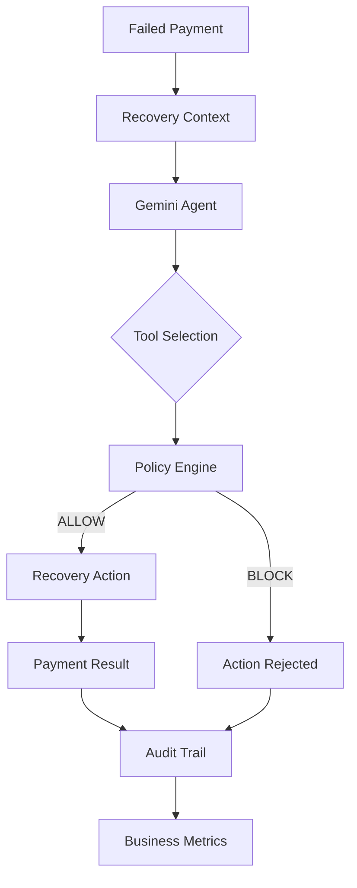

# RecoverIQ
RecoverIQ is an AI-powered revenue recovery agent designed to intelligently salvage failed payments. By combining the reasoning capabilities of Google Gemini with a deterministic, rule-based PolicyEngine, RecoverIQ safely orchestrates recovery workflows—such as retries, reminders, and incentives—without hallucinating unauthorized actions.


## 🎯 Track 03 — AI Revenue Recovery
Built for the **Razorpay AI Builder Internship 2026 / AI Buildathon — Track 03**, RecoverIQ directly addresses the challenge of autonomous payment revenue recovery. It demonstrates how Large Language Models can be constrained by deterministic boundaries to safely operate within financial workflows.

## 🚨 Problem
Failed payments constitute a massive source of invisible revenue leakage for online merchants. Traditional recovery relies on rigid, rule-based dunning campaigns or expensive manual intervention. These static methods fail to consider customer lifetime value, historical success rates, or contextual nuances, leading to lost revenue and churn.

## 💡 Solution
RecoverIQ introduces a closed-loop approach. It monitors payment failures, aggregates customer context, and delegates the recovery strategy to an AI agent. The agent dynamically decides whether to retry a card, send a reminder, offer a discount, or escalate for manual review—all strictly governed by merchant-defined policies.

## 🧠 How the AI Agent Works
RecoverIQ utilizes the Gemini Interactions API with strict function calling. When a payment fails, the agent is provided with recovery context and a set of available tools. The agent analyzes the context and dynamically selects the best tool to execute. This replaces static if/else dunning logic with contextual reasoning.

## 🏗️ Architecture



## 🔄 Recovery Workflow
1. **Detection:** A payment failure is detected.
2. **Context Aggregation:** Customer history and payment details are gathered.
3. **Orchestration:** The Gemini Agent analyzes the context and proposes an action.
4. **Authorization:** The PolicyEngine evaluates the proposed action against merchant rules.
5. **Execution:** If allowed, the MockPaymentGateway executes the action (e.g., retry).
6. **Logging:** Every decision and outcome is immutably recorded in the Audit Trail.

## 🛡️ Policy Engine & Guardrails
**"Gemini proposes. PolicyEngine authorizes."**

This is the core architectural principle of RecoverIQ. The Gemini model is **NOT** the authorization layer. LLMs are non-deterministic and prone to hallucination; they cannot be trusted to independently mutate financial state.

To guarantee safety, all consequential agent actions are routed through a deterministic `PolicyEngine`. 
- **Deterministic Rules:** The engine strictly enforces merchant policies (e.g., maximum retries, maximum discount percentages).
- **Bounded Actions:** The agent can only execute predefined tools.
- **Policy Blocks:** If the agent proposes an action that violates policy, the engine blocks it and returns the rejection reason to the agent, forcing it to adjust its strategy.
- **Escalation:** High-value or complex cases can be escalated for human review.
- **Audit Logging:** Every proposal and policy decision is logged.
- **Payment Service Boundary:** The agent cannot interact with the payment gateway directly.

## 🧰 Agent Tools

| Tool | Purpose | Consequential? |
| :--- | :--- | :--- |
| `get_payment_details` | Retrieve specific details about the failed transaction. | No |
| `get_customer_history` | Retrieve customer lifetime value and past failures. | No |
| `calculate_recovery_context` | Aggregate context to inform recovery strategy. | No |
| `verify_payment_status` | Check the current status of the payment. | No |
| `retry_payment` | Attempt to charge the payment method again. | **Yes** |
| `send_payment_reminder` | Dispatch a payment reminder to the customer. | **Yes** |
| `offer_recovery_incentive` | Propose a discount or incentive to recover the cart. | **Yes** |
| `escalate_case` | Flag the payment for manual human intervention. | **Yes** |

## 💰 Deterministic Recovery Scenarios
RecoverIQ is evaluated against four specific synthetic scenarios:
1. **FAILED → SUCCESS:** A simple failure that succeeds on the first AI-driven retry.
2. **FAILED → FAILED → SUCCESS:** A persistent failure requiring multiple attempts or different strategies before success.
3. **FAILED → FAILED → FAILED:** An unrecoverable payment that exhausts policies and is marked as failed.
4. **SUCCESS → Retry Rejected:** An edge case where the agent attempts to recover an already successful payment, which is blocked.

## 📊 Evaluation
RecoverIQ includes a deterministic batch evaluation harness using synthetic failed-payment scenarios to test the agent's effectiveness and policy adherence. 

Run the evaluation dashboard to generate the current batch metrics.

| Metric | Description |
| :--- | :--- |
| **Recovery Rate** | Percentage of failed payments successfully recovered. |
| **Revenue Recovered** | Total monetary value salvaged by the agent. |
| **Policy Blocks** | Number of times the PolicyEngine blocked an unauthorized action. |
| **Average Attempts** | Average number of agent steps required to reach a terminal state. |

## 🖥️ Product Screenshots

*<!-- docs/screenshots/dashboard.png -->*
**1. Dashboard**

*<!-- docs/screenshots/payment_details.png -->*
**2. Payment Details + Agent Timeline**

*<!-- docs/screenshots/escalations.png -->*
**3. Escalations**

*<!-- docs/screenshots/evaluation.png -->*
**4. Evaluation Dashboard**

## 🧪 Testing
The application backend is tested using **Jest** and **Supertest**. Tests cover:
- API endpoint routing and response formatting.
- PolicyEngine deterministic rule evaluation.
- Agent tool registry and tool execution behavior.

## ⚙️ Tech Stack

| Domain | Technologies |
| :--- | :--- |
| **Frontend** | React, Vite, TypeScript, Tailwind CSS, Recharts, Lucide React |
| **Backend** | Node.js, Express, TypeScript |
| **Database** | PostgreSQL, Prisma, Supabase |
| **AI** | Google Gemini, `@google/genai` (Interactions API) |
| **Testing** | Jest, Supertest |

## 📁 Project Structure

```text
c:\RecoverIQ\
├── backend/
│   ├── prisma/             # Database schema and seed data
│   └── src/
│       ├── agent/          # Agent orchestration and Gemini integration
│       ├── controllers/    # API request handlers
│       ├── evaluation/     # Batch evaluation harness
│       ├── policy/         # Deterministic authorization engine
│       ├── routes/         # Express API routes
│       └── services/       # Payment and business logic
└── frontend/
    ├── src/
    │   ├── components/     # Reusable React UI components
    │   ├── layouts/        # Application wrappers
    │   ├── pages/          # Primary views (Dashboard, Evaluation, etc.)
    │   ├── services/       # API client utilities
    │   └── utils/          # Formatting and helpers
    └── vite.config.ts      # Vite configuration
```

## 🚀 Getting Started

### Prerequisites
- Node.js (v20+)
- PostgreSQL database (or Supabase)
- Google Gemini API Key

### 1. Database Setup
Ensure you have a PostgreSQL instance running. Create a `.env` file in the `backend/` directory based on `.env.example`:

```bash
cd backend
# Edit .env to add your DATABASE_URL and GEMINI_API_KEY
```

Install dependencies and initialize the database:
```bash
npm install
npm run prisma:generate
npm run prisma:migrate
npm run prisma:seed
```

### 2. Start Backend
```bash
npm run dev
```

### 3. Start Frontend
In a new terminal window:
```bash
cd frontend
npm install
npm run dev
```

## 🔐 Environment Variables
Refer to `backend/.env.example`. You must provide a valid `DATABASE_URL` and `GEMINI_API_KEY`. **Never commit your actual `.env` file containing real secrets to version control.**

## 🎬 Demo Flow
1. **Open Payments:** Navigate to the payments list to view seeded data.
2. **Select a failed payment:** Click on a payment marked as `FAILED`.
3. **Show recovery context:** Review the customer and transaction details.
4. **Trigger AI Recovery:** Initiate the agent run.
5. **Show Gemini tool calls:** Watch the real-time agent timeline as it requests tools.
6. **Show PolicyEngine decision:** Observe the engine allowing or blocking actions.
7. **Show recovery action/payment result:** See the terminal state change.
8. **Show audit trail:** Review the immutable log of the recovery attempt.
9. **Open Evaluation:** Run the batch evaluation harness to view aggregate performance.

## 🧩 Design Decisions
- **Single Agent vs. Multi-Agent:** We opted for a single, well-prompted agent with access to multiple tools rather than a complex multi-agent swarm. This reduces latency, simplifies the architecture, and keeps token costs low for payment workflows.
- **Deterministic PolicyEngine:** LLMs cannot be trusted with financial mutation. The PolicyEngine guarantees that even if the agent hallucinates, invalid actions are blocked.
- **MockPaymentGateway:** Used to safely simulate payment processing and failure scenarios for testing without touching real money.
- **PostgreSQL / Prisma:** Provides relational integrity for payments, policies, and audit trails.
- **Deterministic Evaluation:** Batch evaluation relies on predictable synthetic data to accurately measure the agent's decision-making logic across controlled scenarios.

## 🔮 Future Improvements
- **Real Payment Gateway Integration:** Connecting the MockPaymentGateway to Razorpay's test mode.
- **Advanced Merchant Policies:** Allowing dynamic rule creation via a merchant dashboard.
- **Rate-Limit Handling:** Implementing robust exponential backoff for the Gemini API.
- **Production Observability:** Adding tracing (e.g., OpenTelemetry) for agent decision trees.
- **Omnichannel Recovery:** Expanding tools to include SMS, WhatsApp, and email recovery flows.

## 📌 Limitations
- **Mock Payment Gateway:** The system currently simulates payment processing.
- **API Rate Limits:** Running the batch evaluation on the Gemini Free Tier can hit the 15 RPM quota limit. The evaluation runner throttles requests sequentially, but large batches may still require a paid tier.
- **Synthetic Data:** Evaluation relies on seeded fixture data rather than production traffic.

## 👩‍💻 Built For
Razorpay AI Builder Internship 2026 / AI Buildathon — Track 03.